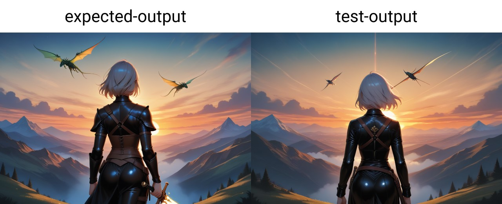

sd1.5 to sdxl Textual Inversion converter
=========================================

Introduction
------------

[SDXL](https://huggingface.co/stabilityai/stable-diffusion-xl-base-1.0) leverage two CLIP models as text encoders for conditionning [OpenCLIP-ViT/G](https://github.com/mlfoundations/open_clip) and [CLIP-ViT/L](https://github.com/openai/CLIP/tree/main).
[SD1.5](https://huggingface.co/stable-diffusion-v1-5/stable-diffusion-v1-5) only used [CLIP-ViT/L](https://github.com/openai/CLIP/tree/main).

A Textual Inversion (TI) is a set of pre-encoded or trained embeddings that can be added as-is for conditionning. As such, SDXL TI contains CLIP_L and CLIP_G embeddings when SD1.5 TI contains only CLIP_L embeddings.

The model proposed here as been trained on embedding pairs seen in SDXL TI to predict the CLIP_G embedding corresponding to the associated CLIP_L.

This allows converting SD1.5 TI to SDXL TI by predicting the missing CLIP_G.


Usage
-----

- Install torch and tqdm (preferably in a virtualenv)
- Download the model.safetensors file (from the release)
- Run `python convert.py input.pt output.safetensors` or `python convert.py input.safetensors output.safetensors`

Example:
```
(venv) c:\sdxl-embedding-converter> python convert.py wendyGNRC.pt wendyGNRC.safetensors
WARNING! You are loading a PickleTensor file, please confirm... (Y/N) y
Found 10 embeddings to convert.
Starting conversion...
100%|██████████████████████████████████| 10/10 [00:00<00:00, 285.71it/s]
Done! Saving wendyGNRC.safetensors
Finished!
```

The conversion can be done on CPU, the model is very small.

Training
--------

For convenience, the training script is provided. It needs a `dataset.safetensors` that can be built by adding several SDXL TI in safetensors format in data folder and running `build-dataset.py`

The training can be restarted from a previous epoch by providing the safetensors file as argument `train.py previous-epoch-002.safetensors` and run by default for 10 epochs.

The provided model is epoch 7 of my training parsing 168122 embedding pairs. Using the `evaluate.py` script on the full dataset (including the training and evaluation data) yield this value for the difference between expected and computed:

```
Found 186803 embeddings to evaluate.
Starting evaluation...
100%|██████████████████████████████████| 186803/186803 [02:53<00:00, 1075.25it/s]
Standard deviation: 0.0065
Mean: 0.0033
Finished!
```

Test
----

The test folder contains a TI generated using the [Embedding Merge](https://github.com/klimaleksus/stable-diffusion-webui-embedding-merge) [SD-WEBUI](https://github.com/AUTOMATIC1111/stable-diffusion-webui) extension:

- The prompt parsed for generation is `a beautiful landscape picture, sunset over a fantasy valley, dragon flying in the sky, a beautiful warrior woman in leather and holding a magic sword is looking away, cowboy shot, from behind`
- `test-input.safetensors` is the SD1.5 version of the TI
- `expected-output.safetensors` is the SDXL version of the TI
- `computed-output.safetensors` is the converted SDXL version made using the SD1.5 version and this model.

The resulting usage of these embeddings alone in a prompt using SD-WEBUI yield these pictures:


Dataset
-------

The original dataset is not provided as it contained downloaded data. It consisted of:
- ~200 SDXL TI (either made for SDXL 1.0 or its derivative: Pony V6 and Illustrious XL v0.1) downloaded from [Civitai](https://civitai.com/) plus ~50 TI generated using the Embedding Merge extension for a total of around 30k pairs.
- ~150k pairs generated using Embedding Merge on each **word** in the SDXL 1.0 [vocab.json](https://huggingface.co/stabilityai/stable-diffusion-xl-base-1.0/blob/main/tokenizer/vocab.json) file using a **lazy hack** button added in the extension calling the code below.

```
def gr_arno():
    with gr_lock:
        try:
            sd_models.reload_model_weights()
        except:
            pass
    with open(vocabpath, encoding='utf-8') as f:
        vocab = json.load(f)
    clip_l = []
    clip_g = []
    for t in tqdm(vocab.keys()):
        two = text_to_vectors(t)
        l = two[0][0][0]
        g = two[1][0][0]
        for i in range(l.shape[0]):
            clip_l.append(l[i])
            clip_g.append(g[i])
    dataset = {}
    dataset['clip_l'] = torch.stack(clip_l,dim=0)
    dataset['clip_g'] = torch.stack(clip_g,dim=0)
    save_file(dataset, savepath)
```

Permissions
-----------

- Fair use of this model and scripts is provided as long as the original authors of any converted SD1.5 TI is mentionned.
- Any commercial use of this model and/or any finetuned/trained versions is forbidden
- Commercial use of converted SDXL TI is allowed for the original author of the SD1.5 TI
